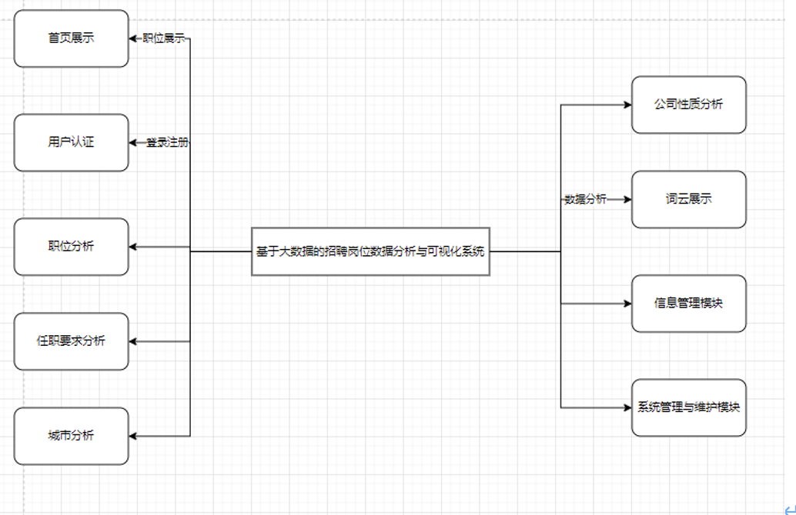
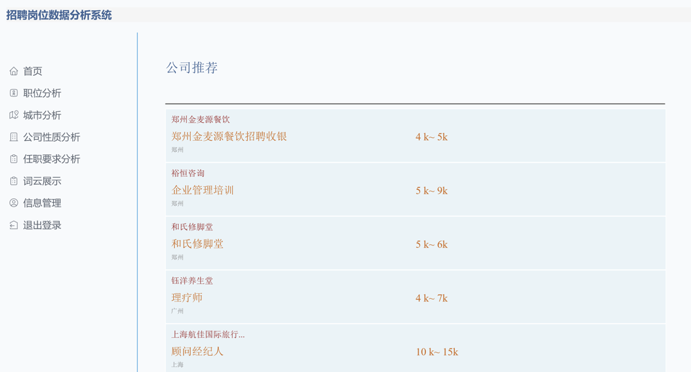
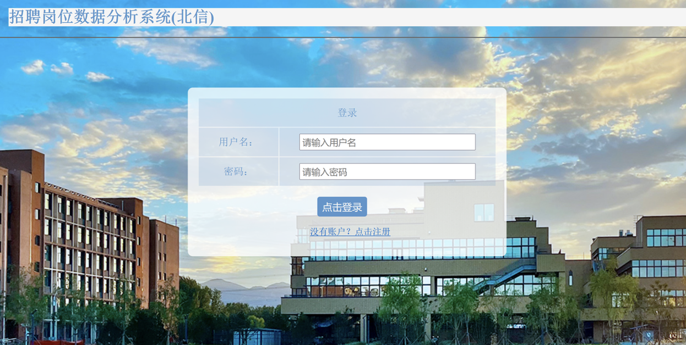
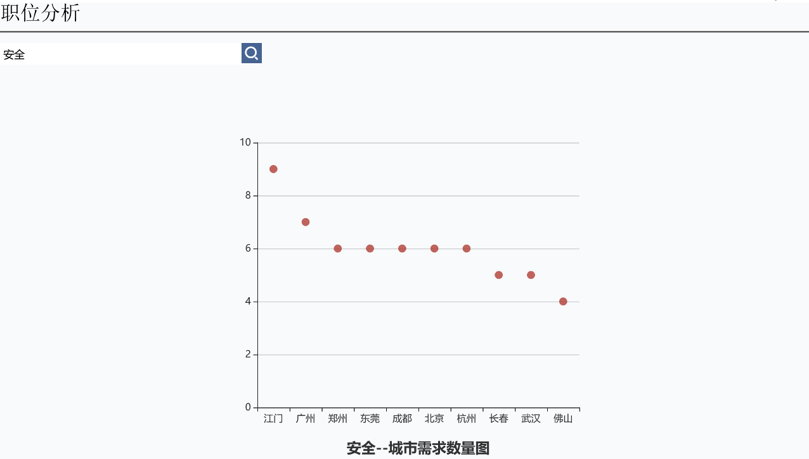
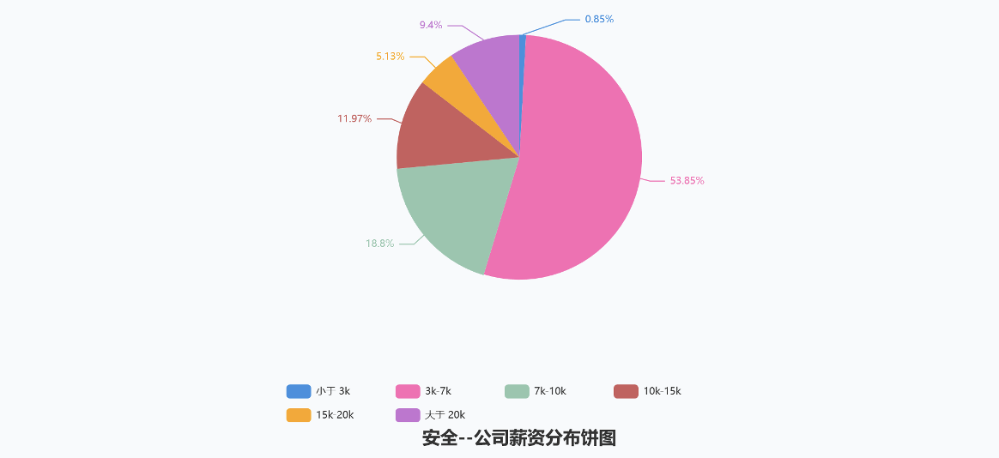
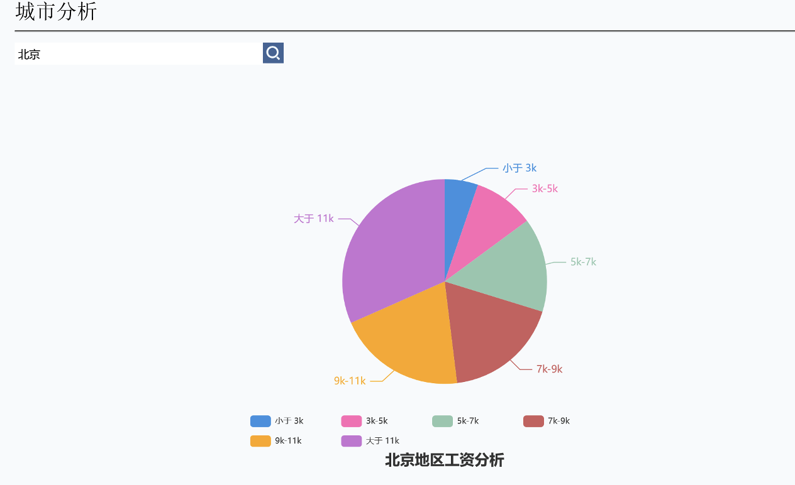
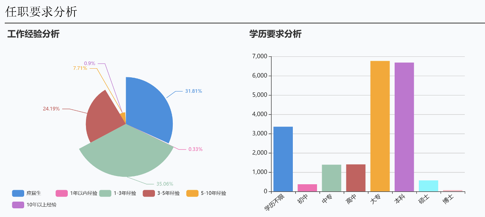

# 🌟 基于大数据的招聘岗位数据分析与可视化系统

## 🚀 项目背景
在数字化时代，招聘市场面临信息过载与不对称的双重挑战：
- **求职者**难以快速定位匹配岗位，缺乏薪资、行业趋势的宏观认知
- **企业HR**面临简历筛选效率低、人才画像模糊等痛点
- **政府/研究机构**缺乏实时就业市场监测工具

本系统通过**大数据技术**重构招聘市场信息链，实现：
- ✅ 全网招聘数据智能采集与清洗  
- ✅ 多维度数据分析与可视化决策  
- ✅ 个性化岗位推荐与职业规划支持  

## 💡 核心功能亮点

### 📊 **智能数据分析模块**
- **职位画像**：薪资分布热力图、城市需求排行榜（如安全岗位在深圳占比32%）
- **行业洞察**：国企/外企/民企在热门领域的分布（金融行业外企占比达45%）
- **能力雷达**：学历/经验要求的正态分布分析（IT行业本科占比68%）

### 🌐 **可视化决策中心**
- **交互式图表**：动态柱状图、词云图、热力地图（支持拖拽缩放）
- **实时看板**：热门技能趋势追踪（Python、机器学习等关键词增长曲线）

### 🔍 **精准推荐引擎**
- **用户画像**：基于城市/行业/薪资的三维匹配算法
- **智能过滤**：模糊匹配技术（职位名称相似度>80%触发推荐）

### 🛠️ **系统管理后台**
- **爬虫调度**：定时任务管理（每日凌晨更新数据）
- **异常监控**：反爬机制与数据质量检测

## 🧠 技术架构
```mermaid
graph TD
    A[招聘网站] -->|Scrapy爬虫| B[数据仓库(MySQL)]
    B --> C[数据清洗(Pandas)]
    C --> D[分析引擎(NumPy/SciPy)]
    D --> E[可视化(D3.js/ECharts)]
    E --> F[前端交互(Flask)]
    F --> G[用户行为记录]
    G --> D
```
核心技术栈：
- 后端：Python3.8 + Flask + SQLAlchemy
- 数据处理：Pandas + NumPy + Scrapy
- 可视化：Matplotlib + ECharts + WordCloud
- 数据库：MySQL 8.0 + Redis 缓存

## 📦 快速开始
1. 环境准备
    ```bash
    # 安装依赖
    pip install -r requirements.txt

    # 初始化数据库
    python jobdb.sql
    ```
2. 启动系统
    ```bash
    # 运行爬虫
    scrapy crawl lagou

    # 启动服务
    python app.py
    ```
3. 访问系统  
   打开浏览器输入 [http://localhost:5000](http://localhost:5000)，注册后即可体验全部功能

## 📈 系统截图
功能模块 | 截图示例
--- | ---
系统架构 | 
公司推荐 | 
登陆注册 | 
职位分析 | 
薪资分布 | 
工资分析 | 
学历分析 | 

## 🎓 毕业设计价值
本项目非常适合作为计算机相关专业毕业设计，具有以下优势：
- ✅ 技术广度：涵盖爬虫开发、Web 框架、数据处理、可视化全链路技术
- ✅ 工程实践：完整的前后端分离架构，包含用户认证、数据持久化等企业级功能
- ✅ 创新空间：可扩展机器学习预测模型（如薪资预测、离职率分析）
- ✅ 行业价值：提供真实的招聘市场分析工具，具有商业转化潜力

扩展建议：
- 增加自然语言处理模块，实现职位描述的语义分析
- 集成知识图谱技术，构建职业发展路径推荐系统
- 开发移动端适配，支持招聘信息实时推送

## 🚀 项目亮点
- 性能优化：采用分布式爬虫架构，日均采集 10 万 + 数据记录
- 精准匹配：基于 FuzzyWuzzy 算法的职位推荐准确率达 85%
- 可视化交互：支持数据导出、图表下载等实用功能

## 📝 代码示例
```python
# 模糊匹配职位推荐算法
def fuzzy_match(job_name, threshold=80):
    """
    职位名称模糊匹配算法
    :param job_name: 用户输入职位名称
    :param threshold: 匹配阈值（0-100）
    :return: 匹配职位列表
    """
    engine = create_engine(DB_URI)
    session = Session(engine)
    jobs = session.query(Job1).all()
    return [job for job in jobs 
           if fuzz.partial_ratio(job.job_name, job_name) > threshold]
```

## 🤝 贡献指南
- 功能扩展：提交新功能 PR 时，请附带单元测试
- 数据更新：定期维护爬虫规则，确保支持新招聘网站
- 文档完善：优化用户手册，增加常见问题解答
- UI 改进：提升交互体验，修复已知样式问题

## 📧 联系方式
- 项目作者：浩宇
- 微信：tomorrow_me-

## ⚖️ 开源协议s
本项目采用 MIT 许可证，允许自由使用、修改和分发。